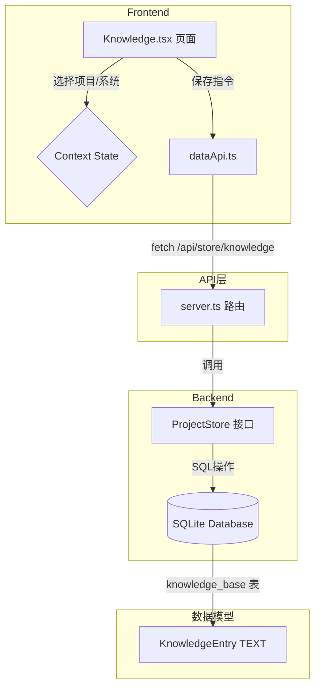

# 知识库模块功能实现计划

## 1. 分析结论

### 1.1 现状问题
根据代码分析，知识库模块 (`Knowledge.tsx`) 目前存在以下问题：

| 模块 | 文件 | 现状 |
|------|------|------|
| **前端页面** | `packages/app/src/screens/Knowledge.tsx` | 只有静态UI框架，数据来自 `context.tsx` 的 Mock 数据（硬编码初始值） |
| **状态管理** | `packages/app/src/context.tsx` | `knowledge` 数组初始为空，仅支持 `KNOWLEDGE_UPDATE`（修改content），缺少新增/删除能力 |
| **数据层** | `packages/app/src/services/dataApi.ts` | 无任何知识库相关 API 调用 |
| **后端存储** | `packages/infra-store/src/index.ts` | 无知识库表结构，无 CRUD 方法 |
| **后端路由** | `packages/orchestrator/server.ts` | 无知识库 API 路由 |

### 1.2 用户需求
1. **知识库需与项目管理联动**：知识库的"系统"树应展示项目管理中实际存在的项目和系统（父子集关系）
2. **支持指令设置**：可为每个项目/系统设置独立的 AI 指令（Prompt）
3. **数据持久化**：指令内容以 TEXT 类型整段存入数据库

---

## 2. 实施步骤

### 2.1 数据存储层改造 (`infra-store`)
**文件**: `packages/infra-store/src/index.ts`

**改造内容**:
1. 扩展 `ProjectStore` 接口，增加知识库 CRUD 方法：
   ```typescript
   // 获取指定项目或系统的知识库条目
   getKnowledgeEntry(projectId: string, systemId?: string): Promise<KnowledgeEntry | null>;
   
   // 保存或更新知识库条目（upsert 逻辑）
   saveKnowledgeEntry(entry: KnowledgeEntry): Promise<KnowledgeEntry>;
   
   // 删除知识库条目
   deleteKnowledgeEntry(id: string): Promise<void>;
   
   // 列出所有知识库条目（用于bootstrap加载）
   listKnowledgeEntries(): Promise<KnowledgeEntry[]>;
   ```

2. 在 SQL 初始化中创建 `knowledge_base` 表：
   ```sql
   CREATE TABLE IF NOT EXISTS knowledge_base (
     id TEXT PRIMARY KEY,
     scope TEXT NOT NULL CHECK(scope IN ('project', 'system')),
     project_id TEXT NOT NULL,
     system_id TEXT,
     content TEXT NOT NULL,
     updated_at INTEGER NOT NULL
   );
   ```

3. 定义 `KnowledgeEntry` 数据结构：
   ```typescript
   interface KnowledgeEntry {
     id: string;              // 唯一标识，格式: `kb-${projectId}` 或 `kb-${projectId}-${systemId}`
     scope: 'project' | 'system';
     projectId: string;
     systemId?: string;
     content: string;         // 指令内容（TEXT类型）
     updatedAt: number;
   }
   ```

---

### 2.2 后端API路由扩展 (`orchestrator/server.ts`)
**文件**: `packages/orchestrator/server.ts`

**改造内容**:
在 `handleStore` 函数中添加知识库路由：

| HTTP方法 | 路由 | 功能 |
|---------|------|------|
| `GET` | `/api/store/knowledge` | 获取所有知识库条目 |
| `POST` | `/api/store/knowledge` | 新增知识库条目 |
| `PUT` | `/api/store/knowledge/:id` | 更新知识库条目 |
| `DELETE` | `/api/store/knowledge/:id` | 删除知识库条目 |

同时修改 `/api/store/bootstrap` 接口，在返回数据中增加 `knowledge` 字段。

---

### 2.3 前端数据API封装 (`dataApi.ts`)
**文件**: `packages/app/src/services/dataApi.ts`

**改造内容**:
添加知识库相关 API 函数：
```typescript
export async function listKnowledgeEntries(): Promise<KnowledgeEntryApi[]>;
export async function saveKnowledgeEntry(entry: KnowledgeEntryApi): Promise<KnowledgeEntryApi>;
export async function deleteKnowledgeEntry(id: string): Promise<void>;
```

扩展 `BootstrapData` 接口：
```typescript
export interface BootstrapData {
  projects: Project[];
  systemData: Record<string, {...}>;
  knowledge: KnowledgeEntryApi[];  // 新增
}
```

---

### 2.4 前端状态管理改造 (`context.tsx`)
**文件**: `packages/app/src/context.tsx`

**改造内容**:
1. 扩展 `KnowledgeEntry` 类型：
   ```typescript
   export interface KnowledgeEntry {
     id: string;
     scope: 'project' | 'system';
     projectId: string;
     systemId?: string;
     content: string;
     updatedAt?: number;
   }
   ```

2. 增加 Action 类型：
   ```typescript
   | { type: "KNOWLEDGE_ADD"; entry: KnowledgeEntry }
   | { type: "KNOWLEDGE_REMOVE"; id: string }
   ```

3. 修改 `AppProvider` 的 bootstrap 逻辑：
   - 从 `loadBootstrap()` 结果中提取 `knowledge` 数据
   - 加载到初始 state 中

4. 暴露操作方法：
   - `addKnowledge`: 调用 API 新增知识库条目
   - `updateKnowledge`: 调用 API 更新条目
   - `removeKnowledge`: 调用 API 删除条目

---

### 2.5 前端页面重构 (`Knowledge.tsx`)
**文件**: `packages/app/src/screens/Knowledge.tsx`

**改造内容**:
1. **左侧树形结构（动态生成）**:
   - 根节点："📚 知识库"
   - 第一层：从 `projects` 状态映射所有项目
   - 第二层：展开项目后显示该项目下的 `systems`
   - 每个节点右侧显示是否已配置指令（有内容显示✓，无内容显示+）

2. **右侧编辑区**:
   - 当选中项目/系统节点时，从 `knowledge` 状态查找对应条目
   - 显示已有的指令内容供编辑
   - 若无条目，显示空白编辑区供输入新指令
   - "保存"按钮：调用 `addKnowledge` 或 `updateKnowledge`
   - "删除"按钮：仅对已存在的条目显示，调用 `removeKnowledge`

3. **交互逻辑**:
   - 点击树节点切换编辑目标
   - 保存时校验内容非空
   - 保存成功后 Toast 提示
   - 支持重置（恢复上次保存内容）

---

## 3. 数据流向



---

## 4. 风险与注意事项

1. **数据迁移**: 当前 SQLite 数据库文件 `projects.db` 不存在 `knowledge_base` 表，首次加载时需自动建表（已在 `init()` 中处理）
2. **父子关系同步**: 项目/系统删除时，需级联删除对应的知识库条目（在 `deleteProject`/`removeSystem` 方法中处理）
3. **唯一约束**: 每个项目/系统只能有一条知识库记录，使用 UPSERT 逻辑保证
4. **性能**: 知识库内容为 TEXT 类型整段存储，不做拆分，保证原子性

---

## 5. 执行顺序

| 优先级 | 步骤 | 文件 |
|-------|------|------|
| P0 | 数据存储层改造 | `packages/infra-store/src/index.ts` |
| P0 | 后端路由扩展 | `packages/orchestrator/server.ts` |
| P1 | 前端 API 封装 | `packages/app/src/services/dataApi.ts` |
| P1 | 状态管理改造 | `packages/app/src/context.tsx` |
| P2 | 前端页面重构 | `packages/app/src/screens/Knowledge.tsx` |